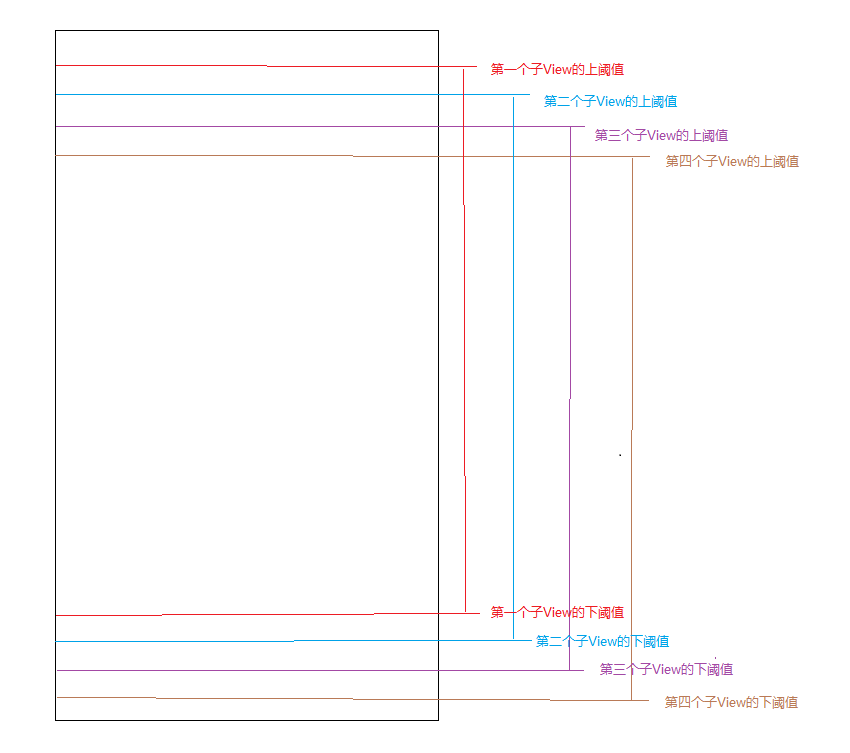
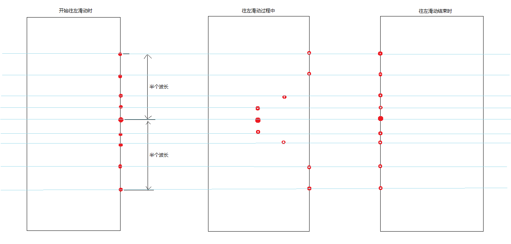

# PileLlayout

###堆叠效果实现
两个辅助类：
**ItemDesc**:记录子View的位置（x、y当前坐标）
**PointDesc**:记录背景贝塞尔曲线控制点坐标
其中
> upThreshold:子View的y坐标的值的上限，不能小于该值
> downThreshold:子View的y坐标的值的下限，不能大于该值

 在滑动过程中，子View间的视觉层叠情况会发生改变：
1. 在顶部，后面的子View遮挡前面的子View
2. 在底部，前面的子View遮挡后面的子View

我们在onLayout方法中，在对子控件布局之前，先对子控件的z坐标进行调整，显示在上层的z坐标值较大。子View的y坐标到达上下阈值时z坐标值小于0.
<pre>
<code>
		//对y坐标达到下边界的子View调整z坐标
		int z = 0;
		for (int i = 0; i < count; i++) {
			final View child = getChildAt(i);
			ItemDesc desc = descMap.get(child);
			if (desc.getCurY() == desc.getDownThreshold()) {
				z--;
				child.setZ(z);
			}
		}

		//对y左边达到上边界的子View调整z坐标
		z = 0;
		for (int i = count - 1; i >= 0; i--) {
			final View child = getChildAt(i);
			ItemDesc desc = descMap.get(child);
			if (desc.getCurY() == desc.getUpThreshold()) {
				z--;
				child.setZ(z);
			}
		}
/code>
</pre>

###事件处理
这里我们既要处理x方向，也要处理y方向。
**Direction**：判定滑动方向的枚举型，有三种取值：
> HORIZONTAL    判定为水平滑动
> 
> VERTICAL       判定为竖直滑动
> 
> NONE            当前无法判定

#####点击事件
响应点击事件的两个条件：
> 1.只有当滑动方向为NONE时，才能触发点击事件
> 2.只有当长按事件没有响应时，才能触发点击事件
> 3.点击是在up事件中触发
<pre>
<code>
				if (mDirection == Direction.NONE) {
					//没有触发长按事件才能触发点击事件
					if (!isLongClick && mOnItemClickListener != null) {
						int position = judgePosition();
						mOnItemClickListener.onItemclick(position);
						isClick = true;
					}
					isLongClick = false;
				}
</code>
</pre>
#####长按事件
响应长按事件的两个条件：
> 1.只有当滑动方向为NONE时，才能触发长按事件
> 2.只有当点击事件没有响应时，才能触发长发事件
> 3.长按是在down事件触发，并自定义延时500ms触发
<pre>
<code>
				postDelayed(new Runnable() {
					@Override
					public void run() {
						if (mDirection == Direction.NONE) {
							//没有触发点击事件，才能触发长按事件
							if (!isClick && mOnItemLongClickListener != null) {
								int position = judgePosition();
								mOnItemLongClickListener.onItemLongClick(position);
								isLongClick = true;
							}
						}
					}
				}, LONG_CLICK_LIMIT);
				isClick = false;
</code>
</pre>

#####点击、长按的是哪个子View
> 1.对所有子View按z坐标值降序排列，传入集合sortChildren中
> 2.顺序遍历sortChildren中的子控件，判断event的x、y值是否在该子控件中。这样使得在上层的子View优先获得事件
> 3.判断接收该子View的事件是第几个子View

###动画处理
动画分为两部分：
1.子View的动画
2.PileLayout背景动画

#####子View的动画
根据手指在屏幕上的滑动位置，更改子View的x坐标
这里使用了一个三角函数：在触摸点对应的y坐标出现波峰

#####背景动画
根据手指在屏幕上滑动的位置，更改贝塞尔控制点的位置。
波峰在触摸点的y坐标。

